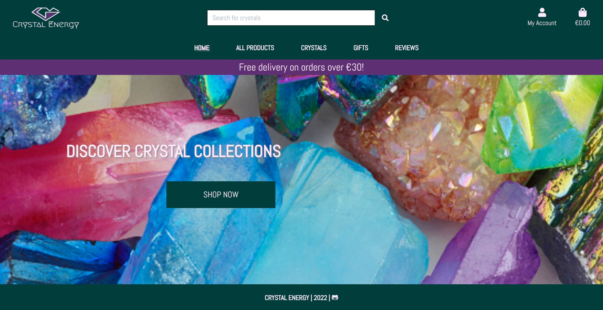
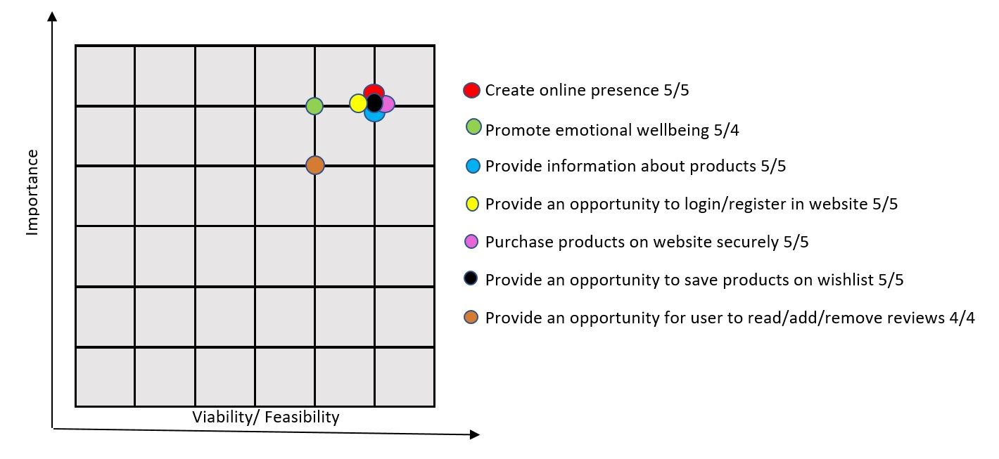
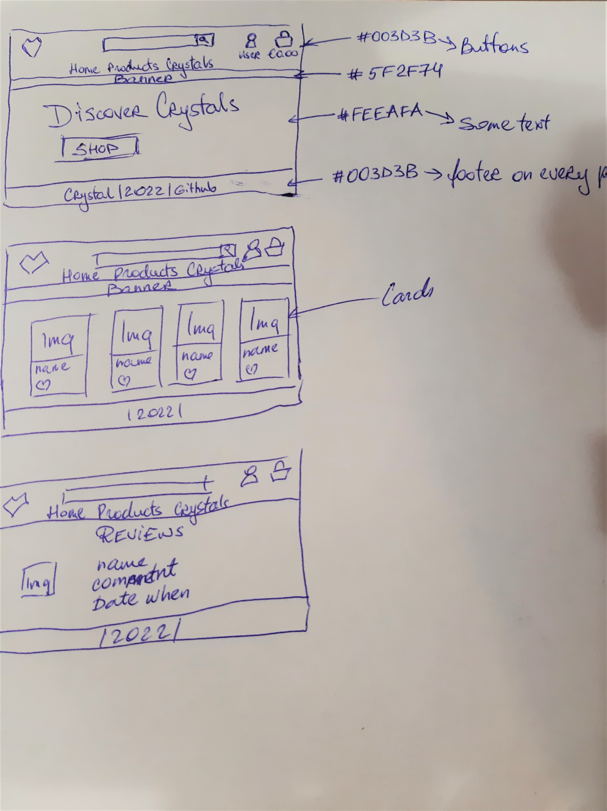
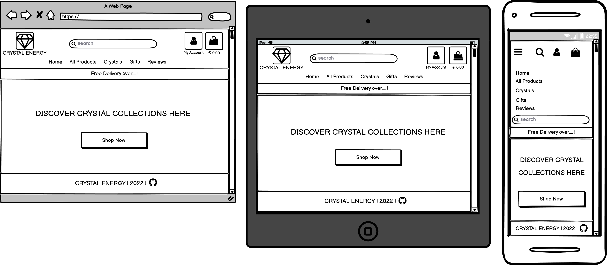

# Crystal Energy



* [Click here](https://crystal-energy.herokuapp.com/) and view the live project.

# Table of contents

1. [Introduction](#Introduction)
2. [UX](#UX)
   * [Strategy](#Strategy)
      * [Website strategy](#Website-strategy)
      * [Target audience](#Target-audience)
      * [External Visitor's goal's](#External-Visitor's-goal's)
      * [Ideal client](#Ideal-client)
      * [Site Owner's goal's](#Site-Owner's-goal's)
   * [Scope](#Scope)
      * [User stories](#User-stories)
      * [Features](#Features)
   * [Structure](#Structure)
      * [Site structure](#Site-structure)
   * [Skeleton](#Skeleton)
      * [Quick sketch](#Quick-sketch)
      * [Wireframes](#Wireframes)
   * [Design](#Design)
      * [Colour scheme](#Colour-scheme)
      * [Fonts](#Fonts)
      * [Media](#Media)
      * [Languages](#Languages)
      * [Technologies Used](#Technologies-Used) 
3. [Completed Live Site](#Completed-Live-Site)
   * [Existing features](#Existing-features) 
   * [Features to Implement in future](#Features-to-Implement-in-future)  
4. [Testing](#Testing)
   * [W3C Validation](#W3C-Validation)
   * [Jshint Validation](#Jshint-Validation)
   * [PEP8 Validation](#PEP8-Validation)
   * [User stories testing](#User-stories-testing)
   * [Functional testing](#Function-testing)
5. [Database Design](#Database-Design)
   * [Database schema](#Database-schema)
6. [Deployment](#Deployment)
   * [GitHub](#GitHub)
   * [Heroku Deployment](#Heroku-Deployment)
   * [AWS Deployment](#AWS-Deployment)
   * [Forking the Repository](#Forking-the-Repository)
   * [Creating a Clone](#Creating-a-Clone)
7. [Credits](#Credits)
   * [Images and text](#Images-and-text)
   * [Helpfull sites](#Helpfull-sites)
   * [Acknowledgements](#Acknowledgements)

# Introduction

Crystal Energy is a virtual E-commerce Website. It provides the user with a list of the various products available for purchase in the store.
The website is fully interactive, built with mobile-first design in mind, and accessible on a wide range of mobile devices, and tablets.

# UX

## Strategy
### Website strategy

* Create online presence
* Promote emotional wellbeing
* Provide information about products
* Provide an opportunity to login/register in website
* Purchase products on website securely
* Provide an opportunity to save products on wishlist
* Provide an opportunity for user to read/add/remove reviews



### Target audience

* People looking for gift ideas
* People seeking a spiritual path
* People seeking inspiration

### External Visitor's goal's

* To find easy accessable information about products
* To be able to quickly navigate throughout the site and find products
* To be able to save products on wishlist and keep them for later
* To be able securely purchase product
* To be able view/add/remove reviews of product
* To be able view purchase history and save billing details
* To be able to search for product

### Ideal client

* A person who is looking for crystals
* A person who is looking for gift

### Site Owner's goal's

* To provide a platform for users to purchase products
* To be able to add/edit/remove products
* To be able to share reviews with my users and to be able to remove my reviews
* To provide an option for users to add/update/remove products from shopping bag
* To provide an option for users to add/remove products on wishlist for later

## Scope
### User stories

1. As a user to this website, I want to view a list of products, so that I can select some to purchase.
2. As a user to this website, I want to view individual product details, so that I can identify the price, description, product rating, product image and available sizes (if applicable).
3. As a user to this website, I want to easily view the total of my purchases at any time, so that I can avoid spending too much.
4. As a user to this website, I want to easily register for an account, so that I can have a personal account and be able to view my profile.
5. As a user to this website, I want to easily login or logout, so that I can access my personal account information.
6. As a user to this website, I want to receive an email confirmation after registering, so that I can verify that my account registration was successful.
7. As a user to this website, I want to have a personalized user profile, so that I can view my personal order history and order confirmations, and save my payment information.
8. As a user to this website, I want to sort the list of available products, so that I can easily identify the best rated, best price and categorically sorted products.
9. As a user to this website, I want to sort a specific category of product, so that I can find the best-priced or best-rated product in a specific category, or sort the products in that category by name.
10. As a user to this website, I want to search for a product by name or description, so that I can find a specific product I’d like to purchase.
11. As a user to this website, I want to add product into wishlist, so that I can look at it later and decide if I want to purchase or remove it from wishlist.
12. As a user to this website, I want to add review on product, so that I can show others my experience with product.
13. As a user to this website, I want to easily select quantity and size (if applicable) of a product when purchasing it, so that I can ensure I don’t accidentally select the wrong product, quantity or size.
14. As a user to this website, I want to view items in my bag to be purchased, so that I can identify the total cost of my purchase and all items I will receive.
15. As a user to this website, I want to adjust the quantity of individual items in my bag, so that I can easily make changes to my purchase before checkout.
16. As a user to this website, I want to easily enter my payment information, so that I can checkout quickly.
17. As a user to this website, I want to view an order confirmation after checkout, so that I can verify that I haven’t made any mistakes.
18. As a user to this website, I want to receive an email confirmation after checking out, so that I can keep the confirmation of what I’ve purchased for my records.
19. As an admin to this website, I want to add a product, so that I can add new products to my store.
20. As an admin to this website, I want to edit/update a product, so that I can change product prices, descriptions, images, and other product criteria.
21. As an admin to this website, I want to delete a product, so that I can remove products that are no longer available.

### Features


## Structure
### Site structure

Website starts with a landing page and from there the user can either follow the main navigation links to all products with sorting options, crystals, gifts or reviews or click on "Shop Now" button and view all products. This page also has a link to the users account which provides the ability to register if they have not already done so. There is also a link to the user's shopping bag.

* The products, crystals, gifts, reviews, shopping bag and checkout pages are available to all users. 
* The wishlist and logout page is available to only registered users.
* The page to add or remove reviews is only avilable to registered users.
* The page to view wishlist and add/remove product on wishlist is only available for registered users.
* The pages to add/update/remove products or to manage reviews are only available for admin/superuser.
* All registered users can access their profile page. This lists their personal details and information on past orders made.
* Admin/superuser also has access to the django admin page where all the data can be accessed and modified.

## Skeleton
### Quick sketch



### Wireframes

View of the main Home page for website:

 

Views of the rest pages on website:

* [Registered user Home page](documentation/wireframes/user_main_page.png "Registered user Home page")
* [Products page](documentation/wireframes/products_page.png "Products page")
* [Registered user Products page](documentation/wireframes/products_user_page.png "Registered user Products page")
* [Product details page](documentation/wireframes/product_view.png "Product details page")
* [Registered user Product details page](documentation/wireframes/product_user_view.png "Registered user Product details page")
* [Reviews](documentation/wireframes/review.png "Reviews")
* [Registered user Reviews](documentation/wireframes/user_review.png "Registered user Reviews")
* [Add Reviews](documentation/wireframes/add_review.png "Add Reviews")
* [Login](documentation/wireframes/login.png "Login")
* [Register](documentation/wireframes/register.png "Register")
* [Logout](documentation/wireframes/logout.png "Logout")
* [Profile](documentation/wireframes/profile.png "Profile")
* [Admin Product Management](documentation/wireframes/product_management.png "Admin Product Management")
* [Wishlist](documentation/wireframes/wishlist.png "Wishlist")
* [Shopping Bag](documentation/wireframes/shopping_bag.png "Shopping Bag")
* [Checkout](documentation/wireframes/checkout.png "Checkout")

## Design
### Colour scheme

Colours of green, pink and purple from [mycolor.space](http://mycolor.space) is used throughout site.


### Fonts

Abel font is a modern interpretation of the condensed flat-sided sans serif. Originally used for newspaper headlines and posters, this style can also be used for text on the web. Its angled terminals and spiked stems give it enough style to be unique at display sizes, while its mono-weight still works well at smaller text sizes.

### Media

Card Panel and contrasting colours are used to strike and catch the user's attention to promote the website.

### Languages

This project uses [HTML5](https://en.wikipedia.org/wiki/HTML5) Hypertext Markup Language (HTML), [CSS3](https://en.wikipedia.org/wiki/CSS) Cascading Style Sheets (CSS), [JavaScript](https://en.wikipedia.org/wiki/JavaScript) JavaScript and [Python](https://en.wikipedia.org/wiki/Python_(programming_language)) Python.

### Technologies Used

* [Django](https://www.djangoproject.com/) framework was used to build the project.
* [mycolor.space](http://mycolor.space) - used for colour palette throughout the site.
* [Google Fonts](https://fonts.google.com/) - were used throughout the site.
* Icons on website were added with [Font Awesome](https://fontawesome.com/).
* [Jinja](https://jinja.palletsprojects.com/en/3.0.x/) - Jinja templating language was used to simplify and display backend data in html.
* [JQuery](https://jquery.com/) JavaScript.
* [Git](https://git-scm.com/) - used for version control to commit to Git and push to Heroku.
* Project code stored on [GitHub](https://github.com/).
* [gitpod.io](https://gitpod.io/workspaces) was used for coding.
* [Heroku](https://www.heroku.com/home) - cloud platform used to deploy application.
* [sqlite](https://sqlite.org/index.html) was used to store data in development and [postgresql](https://www.postgresql.org/) in the deployed project.
* [Amazon Simple Storage Service (s3)](https://aws.amazon.com/products/storage/?nc2=h_ql_prod_st) was used to store the static files for the deployed project.
* [Stripe](https://stripe.com/en-ie) was used as a payment platform for secure checkout and payment.
* [PEP8](https://www.python.org/dev/peps/pep-0008/) - used to check code for PEP8 requirements.
* [PEP8online](http://pep8online.com/) - used to check code for PEP8 requirements.
* [miniwebtool.com](https://miniwebtool.com/django-secret-key-generator/) - used to generate secure password to Secret Key.
* [Bootstrap4](https://getbootstrap.com/) was used for styling.
* [BrandCrowd](https://www.brandcrowd.com/maker/logos) was used to generate logo for website.
* [Gunicorn](https://gunicorn.org/) was used to aid the deployment to Heroku.
* The Django [allauth](https://django-allauth.readthedocs.io/en/latest/) and [crispy forms](https://django-crispy-forms.readthedocs.io/en/latest/) modules were used for this project.
* [Pillow](https://python-pillow.org/) is python imaging library and was used to help processing image files to store in the database.
* [Pyscopg2](https://pypi.org/project/psycopg2/) was used as a PostgreSQL database adapter.
* Wireframes were created on [Balsamiq](https://balsamiq.com/).
* [Shortpixel.com](https://shortpixel.com/pricing-one-time) was used to reduce the size for images.
* [jshint.com](http://jshint.com) used for jQuery code validation.
* [W3C Markup Validation Service](https://validator.w3.org/) used for HTML code validation.
* [W3C CSS Validation Service](https://jigsaw.w3.org/css-validator/) used for CSS code validation.

# Completed Live Site

* [Click here](https://crystal-energy.herokuapp.com/) and view the live site.

## Existing features 

**Home app**
This app introduces the website. It has a navbar at the top that includes logo, search box, links to the users account and their shopping basket. For registered users navbar has wishlist app option. It has the buttons to let users view and sort products and reviews. There is a link in form of button  to a general product app. Footer is placed on the bottom of the page.

**Product app**
This is where all products are displayed. Products can be sorted and by name, price, ratting and category. Each products image links to a page that shows the individual products details. For admin/superuser there are links for pages to edit or remove product. Footer is placed on the bottom of the page.

**Reviews app**
This displays all the reviews that have been added to the site. It can be sorted by author, product name and date posted. Users, who are not logged in can read all the reviews that have been made about all the products and (if registered and logged in) they can add their own review or remove it. Footer is placed on the bottom of the page.

**Shopping bag app**
This can be accessed from the shopping bag icon on the navbar or from the toast that appears when a user adds an item. Page has a form for the user to add their details. It is populated with the user's information if they have previously selected the option to save that infomation to their profile. Shopping bag also shows all the products in the user's shopping bag, the subtotal, delivery charge and a grand total. From here the user has the option to keep shopping or to go to secure checkout. Footer is placed on the bottom of the page.

**Checkout app**
This page has a form for the user to add their details and their credit card number, a summary of the order, and the option to complete the order or return to their shopping bag. Footer is placed on the bottom of the page.

**Profile app**
This displays the user's billing address details, gives them the option to update details. Page also displays a summary of any previous orders user has made. Footer is placed on the bottom of the page.

**Wishlist app**
This displays all the products user has added to wishlist. User has to be registred to do so. Page also displays add to bag and remove buttons for user to decide what to do with product. Using add to bag button user is redirected to products detail page where he/she can decide on quantity or size for product and finally add to bag. Product stays in wishlist if user leaves website and stays for next time when user returns. Footer is placed on the bottom of the page.

## Features to Implement in future

* Functionality for users to edit review
* Order tracking system for user to track their order from the website.
* Every time user clicks on products wishlist heart, it become fully red and stays on product.

# Testing


## W3C Validation

To validate every page of the project, that there were no syntax errors, these two Validators were used, W3C Validator and W3C CSS Validator.
To make make it easier to validate html code, since using jinja templating language throughout all pages, which results in errors in online validators. I used URL address.
For W3C Css Validator I copied css code directly.

* [W3C Validator](project_files/validators/w3c.jpg "W3C Validator")
* [W3C CSS Validator](project_files/validators/W3c_css.pdf "W3C CSS Validator")

## Jshint Validation

For this project I used jQuery - JavaScript Library for MaterializeCSS initialization: "Write less, do more."
Jshint were used to validate jQuery file of this project. [Click](project_files/validators/jshint.jpg) to view report.

## PEP8 Validation

Python code checked for PEP8 requirements. [Click](project_files/validators/pep8.jpg) to view report.

## User stories testing
   
   
## Functional testing

Throughout the website every link, field and icon was tested and all results are displayed on the table below:

| Location | Type | Expected Result | Actual Result | Pass/Fail/Not executed|
| :----: | :----: | :----: | :----: | :----: |
| Navbar | *Home* link | Click on *Home* link navigates to Home page | Navigates to Home page | Pass |
| Navbar | *All Products* link | Click on *All Products* link opens nav dropdown | Opens nav dropdown | Pass |
| Navbar | Crystal Energy Logo | Click on Crystal Energy Logo navigates to Home page | Navigates to Home page | Pass |
| Navbar | *Crystals* link | Click on *Crystals* link opens nav dropdown | Opens nav dropdown | Pass |
| Navbar | *Gifts* link | Click on *Gifts* link opens nav dropdown | Opens nav dropdown | Pass |
| Navbar | *Reviews* link | Click on *Reviews* link navigates to Reviews page | Navigates to Reviews page | Pass |
| Navbar | *By Price* dropdown link | Click on *By Price* dropdown link navigates to Products page with products sorted by price | Navigates to Products page with products sorted by price | Pass |
| Navbar | *By Rating* dropdown link | Click on *By Rating* dropdown link navigates to Products page with products sorted by rating | Navigates to Products page with products sorted by rating | Pass |
| Navbar | *By Category* dropdown link | Click on *By Category* dropdown link navigates to Products page with products sorted by category | Navigates to Products page with products sorted by category | Pass |
| Navbar | *All Products* dropdown link | Click on *All Products* dropdown link navigates to Products page | Navigates to Products page | Pass |
| Navbar | *Angel Healing Crystals* dropdown link | Click on *Angel Healing Crystals* dropdown link navigates to Angel Healing Crystals products | Navigates to Angel Healing Crystals products | Pass |
| Navbar | *Chakra Healing Crystals* dropdown link | Click on *Chakra Healing Crystals* dropdown link navigates to Chakra Healing Crystals products | Navigates to Chakra Healing Crystals products | Pass |
| Navbar | *Best Healing Crystals* dropdown link | Click on *Best Healing Crystals* dropdown link navigates to Best Healing Crystals products | Navigates to Best Healing Crystals products | Pass |
| Navbar | *All Crystals* dropdown link | Click on *All Crystals* dropdown link navigates to All Healing Crystals products | Navigates to All Healing Crystals products | Pass |
| Navbar | *Home* dropdown link | Click on *Home* dropdown link navigates to products categorized for home | Navigates to products categorized for home | Pass |
| Navbar | *Women* dropdown link | Click on *Women* dropdown link navigates to products categorized for women | Navigates to products categorized for women | Pass |
| Navbar | *Men* dropdown link | Click on *Men* dropdown link navigates to products categorized for men | Navigates to products categorized for men | Pass |
| Navbar | *Shop Now* button | Click on *Shop Now* button navigates to Product page | Navigates to Product page | Pass |
| Navbar | *Log In* link | Click on *Log In* link navigates to Log In page | Navigates to Log In page | Pass |
| Navbar | *Register* link | Click on *Register* link navigates to Register page | Navigates to Register page | Pass |
| Navbar | *Profile* link | Click on *Profile* link navigates to Profile page | Navigates to Profile page | Pass |
| Navbar | *Log Out* link | Click on *Log Out* link navigates to Log In page | Navigates to Log In page | Pass |
| Navbar | Search form input field | Search form input field allows to type a text | Allows to type a text | Pass |
| Navbar | Search form *Search* button | Search form *Search* button search for text from input field throughout products and display matching product | Search for text from input field throughout all products and display matching product | Pass |
| Navbar | "Wishlist" icon | Click on *Wishlist* icon navigates to Wishlist page | Navigates to Wishlist page | Pass |
| Navbar | "My Account" icon | Click on *My Account* opens dropdown nav | Opens dropdown nav | Pass |
| Navbar | "Bag" icon | Click on *Bag* icon navigates to Shopping bag page | Navigates to Shopping bag page | Pass |
| Product page | Product image | Click on Product image navigates to Product details page | Navigates to Product details page | Pass |
| Product page | *Heart* icon | Click on *Heart* icon adds product to Wishlist page | Adds product to Wishlist page | Pass |
| Product page | *Edit* link | Click on *Edit* link navigates to Product Management page (only for admin) | Navigates to Product Management page (only for admin) | Pass |
| Product page | *Remove* link | Click on *Remove* link delete product (only for admin) | Delete product (only for admin) | Pass |
| Reviews page | *Add Review* button | Click on *Add Review* button navigates to Add Review page (only for admin and registered user) | Navigates to Add Review page (only for admin and registered user) | Pass |
| Reviews page | *Remove* button | Click on *Remove* button delete review (only for admin and registered user) | Delete review (only for admin and registered user) | Pass |
| Wishlist page | *Add to Bag* button | Click on *Add to Bag* navigates to Product detail page (only for admin and registered user) | Navigates to product detail page (only for admin and registered user) | Pass |
| Wishlist page | *Remove* button | Click on *Remove* button delete product from Wishlist (only for admin and registered user) | Delete product from Wishlist (only for admin and registered user) | Pass |
| Wishlist page | *Keep Shopping* button | Click on *Keep Shopping* button navigates to Product page | Navigates to Product page | Pass |
| Shopping bag page | *Secure Checkout* button | Click on *Secure Checkout* button navigates to Checkout page page | Navigates to Checkout page | Pass |
| Login page | Login form username input field | Log In form username input field allows to type and validate a username | Allows to type and validate a username | Pass |
| Login page | Login form password input field | Log In form password input field allows to type and validate a password | Allows to type and validate a password | Pass |
| Login page | Login form *Log In* button | Log In form *Log In* button verify username, password and redirect to user profile page | Verify username, password and redirect to user profile page | Pass |
| Login page | Login form *Register Account* link | Log In form *Register Account* link navigates user to Register page | Navigates user to Register page | Pass |
| Register page | Register form email input field | Register form email input field allows to validate a email | Allows to validate a email | Pass |
| Register page | Register form username input field | Register form username input field allows to create and validate a username | Allows to create and validate a username | Pass |
| Register page | Register form *Log In* link | Register form *Log In* link navigates user to Log In page | Navigates user to Log In page | Pass |
| Footer | *GitHub* icon | Click on *GitHub* icon navigates to [GitHub repository](https://github.com/Sandra-Be/crystal_energy_alfa) | Navigates to [GitHub repository](https://github.com/Sandra-Be/crystal_energy_alfa) | Pass |


# Database Design


## Database schema


# Deployment

## GitHub

* Add this repository to your local workspace:
    * Click on the **Crystal Energy** repository on [GitHub link](https://github.com/Sandra-Be/crystal_energy_alfa).
    * Click on the **Code** button, and copy the URL.
    * Go into your local workspace and open a new terminal.
    * Type `git clone` and paste the URL you copied from GitHub, and press Enter. It shpuld look like this:

```
git clone https://github.com/*username*/*repository*
```
The process of cloning is now completed.
* Open your IDE and run the following command to install the dependencies:
```
pip install -r requirements.txt
```
* Create an env.py file in your project root, and set your environment variables:
```
DEVELOPMENT=1
SECRET_KEY=YOUR_SECRET_KEY
STRIPE_PUBLIC_KEY=YOUR_STRIPE_PUBLIC_KEY
STRIPE_SECRET_KEY=YOUR_STRIPE_SECRET_KEY
STRIPE_WH_SECRET=YOUR_STRIPE_WH_SECRET
```
* In your settings.py file, add your environment settings:
```
import os
    
STRIPE_PUBLIC_KEY = os.getenv('STRIPE_PUBLIC_KEY', '')
STRIPE_SECRET_KEY = os.getenv('STRIPE_SECRET_KEY', '')
STRIPE_WH_SECRET = os.getenv('STRIPE_WH_SECRET', '')
SECRET_KEY = os.getenv('SECRET_KEY', '')
```
* After setting your environment varibles, run the following commands to migrate models:
```
python3 manage.py makemigrations --dry-run
python3 manage.py makemigrations
python3 manage.py migrate --plan
python3 manage.py migrate
```
* Load the data to the database from the db.json file by running following command:
```
python3 manage.py loaddata db.json
```
* Create a superuser for your app:
```
python3 manage.py createsuperuser
```
* Run the following command to start the project:
```
python3 manage.py runserver
```

## Heroku Deployment

* Log into [Heroku.com](https://www.heroku.com/).
* Select `New` on your dashboard and then select `Create new app`.
* Choose a name for your application, select the region closest to your, and then click `Create app`.
* After you created your app click on Resources tab, using the `Add ons` search field, find and select `Heroku Postgres`.
* Select your plan and click confirm.
* In order to use Heroku Postgres you need to install two dependencies `dj_database_url` and `psycopg2-binary`:
```
pip3 install dj_database_url
pip3 install psycopg2-binary
```
* After installing the dependencies, freeze your requirements into `requirements.txt`:
```
pip3 freeze > requirements.txt
```
* In your settings.py file import `dj_database_url` and replace your current Database settings to: 
```
import dj_database_url
    
DATABASES = {
    'default': dj_database_url.parse('DATABASE_URL')
}
```
Your `DATABASE_URL` can be found in your Heroku Apps `Config Var`.
* After setting your Database, run the following commands to migrate models:
```
python3 manage.py makemigrations --dry-run
python3 manage.py makemigrations
python3 manage.py migrate --plan
python3 manage.py migrate
```
* Load the data to the database from the db.json file by running following command:
```
python3 manage.py loaddata db.json
```
* Create a superuser for your app:
```
python3 manage.py createsuperuser
```
* Heroku setup is complete, now add an if statement in your settings.py file to set the DATABASES:
```
if 'DATABASE_URL' in os.environ:
    DATABASES = {
        'default': dj_database_url.parse(os.environ.get('DATABASE_URL'))
    }
    else:
    DATABASES = {
        'default': {
            'ENGINE': 'django.db.backends.sqlite3',
            'NAME': os.path.join(BASE_DIR, 'db.sqlite3'),
        }
    }
```
* Install `gunicorn` and freeze your requirements:
```
pip3 install gunicorn
pip3 freeze > requirements.txt
```
* Create a `Procfile` and add the following code into this file:
```
echo web: gunicorn <app-name>.wsgi:application
```
* Connect to Heroku fom the terminal:
```
heroku login -i
```
* Go to back to the Settings tab on your Heroku dashboard, and click `Reveal Config Vars` and add the following Config Variable, to temporarily disable `COLLECTSTATIC`:
```
DISABLE_COLLECTSTATIC = 1
```
* In your settings.py file add your Heroku app, and `localhost`:
```
ALLOWED_HOSTS = ['YOUR_HEROKU_APP_NAME.herokuapp.com', 'localhost']
```
* In your Heroku app dashboard, click on `Settings` tab on your Heroku dashboard, and click `Reveal Config Vars` and add the following Config Variables:

| Key | Value |
|:----|:------|
| SECRET_KEY | YOUR_SECRET_KEY |
| STRIPE_PUBLIC_KEY | YOUR_STRIPE_PUBLIC_KEY |
| STRIPE_SECRET_KEY | YOUR_STRIPE_SECRET_KEY |
| STRIPE_WH_SECRET | YOUR_STRIPE_WH_SECRET |
| EMAIL_HOST_USER | YOUR_EMAIL_HOST_USER |
| EMAIL_HOST_PASS | YOUR_EMAIL_APP_PASSWORD |

* Then push to Heroku:
```
heroku git:remote -a <your heroku app name>
git push heroku main
```
* Navigate to `Deploy` tab on your Heroku apps Dashboard, and click on `Enable Automatic Deploys`.
* Site is successfully deployed, and any futher changes on the app will automatically be updated everytime they are commited and pushed on GitHub.

## AWS Deployment

* Login to your [AWS Management Console](https://aws.amazon.com), and click on Amazon S3.
* Create a new bucket that matches your App, and uncheck `Block all public access`.
* Enable `Static website hosting` from `Properties` tab.
* Go to `Permissions tab`, and set your CORS (Cross-origin resouce sharing) settings to `enable access` between Heroku and your S3 Bucket by:
```
[
    {
        "AllowedHeaders": [
            "Authorization"
        ],
        "AllowedMethods": [
            "GET"
        ],
        "AllowedOrigins": [
            "*"
        ],
        "ExposeHeaders": []
    }
]
```
* Set your bucket policy using `Policy Generator`.
    * `Select Type of Policy` - S3 Bucket Policy.
    * `Principal` - `*` to allow all principles.
    * `Actions` - Select `Get Object`.
    * `Amazon Resource Name (ARN)` - Paste your Bucket ARN and add `*` at the and of your Bucket Resource key `arn:aws:s3:::bucket_name/*` and then save.
* Click on Access Control List (ACL), and enable `List` on `Everyone (public access)` tab.
* On the top of your AWS Management Console, search for `IAM (Identity Access Management)`.
    * Click on `User Groups` on the left panel, and `Create Group`.
    * Click on `Policies` and `Create Policy`.
    * Click on JSON and select `Import Managed Policy` and search for `AmazonS3FullAccess` and click import.
    * Copy your `Bucket ARN` and paste it into the `Resource`:
```
    "Resource": [
        "arn:aws:s3:::bucket_name",
        "arn:aws:s3:::bucket_name/*"
    ]
```
    * Click on `Review Policy`.
* Go back to `User Groups` and click on the group name you just created, click on the `Permissions` then `Attach Policies` and search for the policy you've just created and then click on `Attach Policy` to attach the policy to the group.
* Click on `Users` and then click on `Add Users`.
    * Set your user's name and give `Programmatic Access`.
    * Click `Next` and add the user in your New Group, and `Create User`.
    * After you created the user download user's `.csv` file which contains user's access key and secret access key.
* Go back to your IDE and install the following dependencies in order to connect Django to AWS S3:
```
pip3 install boto3
pip3 install django-storages
```
* Freeze your requirements:

```
pip3 freeze > requirements.txt
```
* Add it to your installed apps in your settings.py
* Create `custom_storages.py` file in your project root and add the following code, and then save:
```
from django.conf import settings
from storages.backends.s3boto3 import S3Boto3Storage
    
    
class StaticStorage(S3Boto3Storage):
    location = settings.STATICFILES_LOCATION
    
    
class MediaStorage(S3Boto3Storage):
    location = settings.MEDIAFILES_LOCATION
```
* In your `settings.py` file add the following code:

```
# AWS Backend Configuration

    if 'USE_AWS' in os.environ:
        # Cache control
        AWS_S3_OBJECT_PARAMETERS = {
            'Expires': 'Thu, 31 Dec 2099 20:00:00 GMT',
            'CacheControl': 'max-age=94608000',
        }
        
        # Bucket Config
        AWS_STORAGE_BUCKET_NAME = 'YOUR_BUCKET_NAME'
        AWS_S3_REGION_NAME = 'YOUR_BUCKET_REGION'
        AWS_ACCESS_KEY_ID = os.environ.get('AWS_ACCESS_KEY_ID')
        AWS_SECRET_ACCESS_KEY = os.environ.get('AWS_SECRET_ACCESS_KEY')
        AWS_S3_CUSTOM_DOMAIN = f'{AWS_STORAGE_BUCKET_NAME}.s3.amazonaws.com'
    
        # Static and media files
        STATICFILES_STORAGE = 'custom_storages.StaticStorage'
        STATICFILES_LOCATION = 'static'
        DEFAULT_FILE_STORAGE = 'custom_storages.MediaStorage'
        MEDIAFILES_LOCATION = 'media'
    
        # Override static and media URLs in production
        STATIC_URL = f'https://{AWS_S3_CUSTOM_DOMAIN}/{STATICFILES_LOCATION}/'
        MEDIA_URL = f'https://{AWS_S3_CUSTOM_DOMAIN}/{MEDIAFILES_LOCATION}/'
```
* Add the following config variables in your Heroku App, and remove `DISABLE_COLLECTSTATIC=1`:

| Key | Value |
|:----|:------|
| USE_AWS | True |
| AWS_ACCESS_KEY_ID | YOUR_AWS_ACCESS_KEY_ID |
| AWS_SECRET_ACCESS_KEY | YOUR_AWS_SECRET_ACCESS_KEY |

* Your deployment is now complete.

## Forking the GitHub Repository

1. Log into [GitHub](https://github.com/) or [create an account](https://github.com/).
2. Locate the [GitHub Repository](https://github.com/Sandra-Be/crystal_energy_alfa).
3. At the top of the repository, on the right side of the page, select `Fork`.
4. You should now have a copy of the original repository in your GitHub account.

## Creating a Clone

1. Install the [GitPod Browser](https://www.gitpod.io/docs/browser-extension) Extension for Chrome.
2. After installation, restart the browser.
3. Log into [GitHub](https://github.com/) or [create an account](https://github.com/).
4. Locate the [GitHub Repository](https://github.com/Sandra-Be/crystal_energy_alfa).
5. Click the green `GitPod` button in the top right corner of the repository. This will trigger a new gitPod workspace to be created from the code in github where you can work locally.

### How to run this project within a local IDE, such as VSCode

1. Log into [GitHub](https://github.com/) or [create an account](https://github.com/).
2. Locate the [GitHub Repository](https://github.com/Sandra-Be/crystal_energy_alfa).
3. Under the repository name, click `Clone or download`.
4. In the Clone with HTTPs section, copy the clone URL for the repository.
5. In your local IDE open the terminal.
6. Change the current working directory to the location where you want the cloned directory to be made.
7. Type 'git clone', and then paste the URL you copied in Step 3.
```
 git clone https://github.com/USERNAME/REPOSITORY
```
8. Press Enter. Your local clone will be created.

Further reading and troubleshooting on cloning a repository from GitHub [here](https://docs.github.com/en/github/creating-cloning-and-archiving-repositories/cloning-a-repository).

# Credits

## Images and text

* The intial design, layout and functionality was taken from the Code Institute's walk through project on Boutique Ado.

## Helpfull sites

* [stackoverflow.com](https://stackoverflow.com/) - website for code tips.
* [learn.codeinstutute.net](https://learn.codeinstitute.net/login?next=/) - HTML, CSS, JavaScript and Python study materials.
* [www.markdownguide.org](https://www.markdownguide.org/basic-syntax) - useful website for Markdown language creating README.md file.

## Acknowledgements 

* My mentor Dick Vlaanderen for helpful feedback.
* Student support at Code Institute Slack platform for their support.